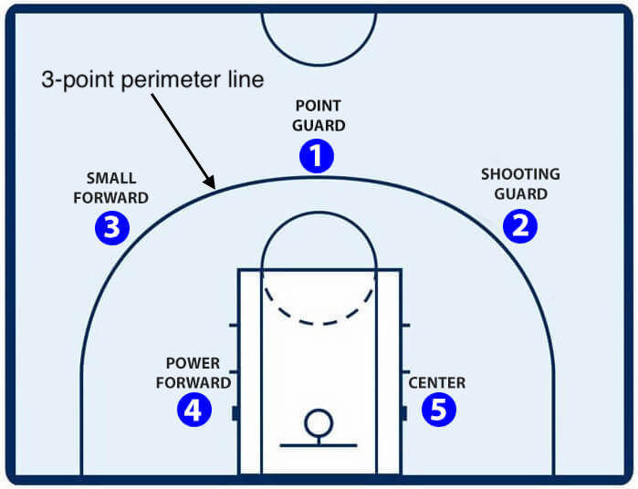
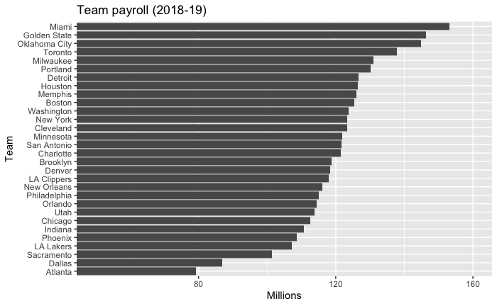
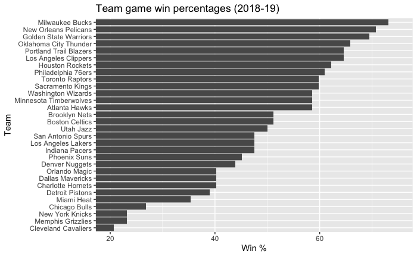
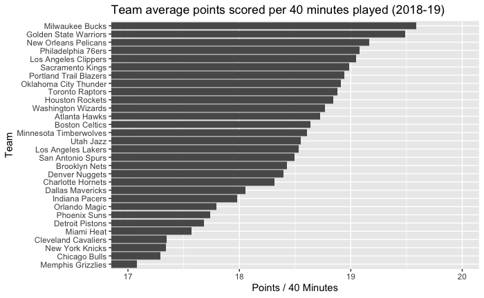

```{r setup, include=FALSE}
knitr::opts_chunk$set(echo = TRUE)
library(tidyverse)
library(broom)
library(ggrepel)
```
### Working Parameters:
- Select 5 'starting' players
- Total Team Salary $118 million

## Introduction
#### Basketball context
Basketball is a game played between two teams of 5-players on a rectangular court indoors or outside. Teams score by having the ball pass through a ring approximately 24cm in diameter and 10feet (3.048m) high (1). The ball can pass through the scoring ring by being placed or thrown (a shot) and may accrue scores of 1, 2 or 3 points depending on circumstances. In summary 3-points are scored for a successful shot when taken *beyond* the 3-point perimeter line (fig. 1). Two-points are scored for a successful shot during standard play but taken *within* the 3-point perimeter line. One-point is scored for each 'free-throw' that may be taken when the opposition team commits a 'foul' as judged by one of two on-court referees under the rules of the game.

Games are usually played over four quarters of approximately 12-minutes (48min total), however this is not standardized across all official competitions. The team with the most accrued points at the end of full-time wins. The pre-eminent competition in the world is the National Basketball Association (NBA) in the USA (2).


{width=30%}


Five players from each team take the court at any given time. In the NBA up to 7-players can be sitting court-side and be substituted in to the game during allocated times in the game. A full team annual roster can comprise a maximum of 15-players. The five players that are on the court at the start of the game (starting players) are generally considered the teams best playing combination. 

There are 5 specific playing positions (fig. 1) that align with particular physical, technical or playing role attributes of each player. The Center (C) and Power Forward (PF) are generally the tallest and strongest players. The Small Forward (SF) is slightly smaller and more agile than the PF. The Shooting Guard (SG) and Point Guard (PG) are commonly the smallest and most agile players adept at ball handling and leading the on-court team strategies. The tallest players (C, PF) are often the highest scoring players but also effective in defending or blocking the opposition scoring opportunities. The smaller players (SF, SG, PG) that may not score as highly are often effective in controlling team possession and 'assisting' scoring through delivery of the ball to the taller scoring players.

Basketball has many opportunities for statistical analyses. Common foundation metrics collected for analysis include Games played by each player, team winning percentages, team and individual scoring averages. Other metrics may assist in analysing the methods behind scoring and defending such as 'assists' where a player has provided the final delivery of the ball to the player that scores as a result; 'rebounds' where a player jumps to collect the ball in either attack or defense to take possession of a scoring shot that missed passing through the ring. This metric reflects a teams capacity to gain possession and control of the ball for the next scoring opportunity; 'blocks' occur when a player directly blocks a scoring attempt by the opposition in the act of attempting to score. Player *value* may be evaluated by their effectiveness to score points for their team, but also in their capacity to prevent the opposition form scoring.

[A link to common data filed metrics can be found here](https://uclearn.canberra.edu.au/courses/9531/pages/data-description-reproducible-data-analysis-project)

The Chicago Bulls (fig 2.) are one of 30 privately owned teams playing in the NBA. 
{width=20%}

Teams play 82 games per season. Due to the private enterprise structure of the NBA teams do not have equal resources to field a team each season. The Chicago Bulls in season 2018-19 were ranked 24th of 30 for the size of their player contract budget ($112.5 million) (fig 3.)



#### Project Scenario, aim and importance
For the coming NBA season (2019-20) the owners of the Chicago Bulls would like to use data analytics methods to evaluate and find a starting 5 combination that will enhance their potential to win a higher percentage of games in the season. Last year the Chicago Bulls won approximately **27%** of their games (fig 4.). The owners have increased slightly the annual payroll for the coming 2019-20 season to **$118 million**. The challenge to address is to discover a starting 5 combination from across the league, ensuring each playing position is filled, that maximises their opportunity to both score highly and restrict the opposition score, yet remains within the salary cap. Also to consider is that the payroll must ultimately account for a full roster of 15 players. Ideally an improved roster of players will see an increased winning percentage. 



Data analytics can develop methods to expose players within the NBA system that have playing attributes, as measured by the available data metrics, that are undervalued in their attacking or defensive effectiveness. The analytics methods can devise algorithms that will identify the key metrics associated with scoring or defensive success as well as associated with winning percentage. The Chicago Bulls were ranked **29th of 30** for points scored per 40 minutes played in the 2018-19 season (fig. 5). By identifying the key metrics, developing an effective algorithm and applying it to the full NBA playing cohort, players that show high scoring or defensive effectiveness, yet come at an affordable price, can be identified and approached to play with the Chicago Bulls.




## Reading and cleaning the data
Each of the data.files provided is named and read in
```{r read in data files}
df_sal <- read_csv("data_raw/2018-19_nba_player-salaries_raw.csv")
df_players <- read_csv("data_raw/2018-19_nba_player-statistics_raw.csv")
df_team_payroll <- read_csv("data_raw/2019-20_nba_team-payroll_raw.csv")
df_team_ptsMP <- read_csv("data_raw/2018-19_nba_team-statistics_2_raw.csv")
df_team_WL <- read_csv("data_raw/2018-19_nba_team-statistics_1_raw.csv")
```

- I aimed to bring the analysis back to 'winning percentage' as a base metric. This is obtained from the *'df_team_WL'* file, but the salary metric was in 'character' format and required a conversion to 'number' format plus rescaling for aesthetic purposes on the charts (i.e. not logarithmic syntax).

```{r convert payroll(cha) to num and scale}
df_team_payroll$COL1 <- as.numeric(gsub('[$,]', '', df_team_payroll$salary))
df_team_payroll <- mutate(df_team_payroll, COL2 = COL1/1000000)
```

- Other *'Team'* metrics were imported such as 'payroll' and data on minutes played for subsequent calculations. Both of the individual player files were utilised for salary information and playing variables. 
- I decided early on that both 'attacking' and 'defensive' player attributes and effectiveness may be relevant in player evaluation. I took an approach that *'player output'* is ultimately measured by their scoring rate, regardless of how that is achieved, i.e. 1, 2 or 3 point scores. I did not therefore focus on metrics of scoring variety. I decided to look at *'score involvements'* where a player's value in *'assists'* may well be as valuable as those that complete the actual score sequence. Equally so regarding the 'defensive' matrics such as *'rebounds'*, *'blocks'*, *'steals'* and the like as a player that prevents the opposition form scoring may well be as valuable as a player that scores or directly assists scoring. The link to file metrics is provided in the introduction.
- Due to that players in each team do not play an equivalent number of minutes all metrics needed to be standardised to a common base comparator. There are many ways to achieve this however I chose a method that has been used previously to standardise basketball metrics. I have standardised all metrics of interest to ***'x per 40 min'*** (3).

```{r standardise team points to /40min}
df_team_pts40 <- mutate(df_team_ptsMP, team_pts40 = (PTS / MP)* 40 )
```

- below are the chunks that generated the figures used through the introduction.

**Season Team Payroll**
```{r barplot payroll figure 3}
# Barplot team payrolls
team_sal <- ggplot(data = df_team_payroll, aes(x = reorder(team, COL2), y = COL2)) +
  geom_bar(stat="identity")
# Horizontal bar plot
new <- team_sal + coord_flip(ylim = c(50, 160))
#label axes
new + labs(title = "Team payroll (2018-19)", face = "italics", x = "Team", y = "Millions") 
```

**Win % versus team salary**
```{r barplot win percentage}
df_team_WL <- mutate(df_team_WL, winP = (W / (W + L)* 100))
#add win% column
df_team_pts40 <- bind_cols(df_team_pts40, df_team_WL[-c(1:25)])
# team average pts per minute
team_pts40 <- ggplot(data = df_team_pts40, aes(x = reorder(Team, winP), y = winP)) +
  geom_bar(stat="identity")
# Horizontal bar plot
new1 <- team_pts40 + coord_flip(ylim = c(20, 75)) +
  labs(title = "Team game win percentages (2018-19)", x = "Team", y = "Win %")
new1
```

**Teams scoring rate 2018-19 (score / 40 minutes played)**
```{r barplot team points/40min}
# team average pts per minute
ggteam_pts40 <- ggplot(data = df_team_pts40, aes(x = reorder(Team, team_pts40), y = team_pts40)) +
  geom_bar(stat="identity")
# Horizontal bar plot
new2 <- ggteam_pts40 + coord_flip(ylim = c(17, 20)) +
  labs(title = "Team average points scored per 40 minutes played (2018-19)", x = "Team", y = "Points / 40 Minutes")
new2
```

- Here the metrics of interest are standardised to a rate of *per 40 minutes* and written in to a new team file. I was curious about the relationships moving forward regarding the performance parametes of assists, turnovers, steals, blocks, total rebounds, offensive rebounds and defensive rebounds. Each in the context of face-validity regarding scoring or preventing the opposition scoring.

```{r establish new variables}
df_team_pts40 <- df_team_pts40 %>%
  mutate(AST40 = (AST / MP)* 40,
         TOV40 = (TOV / MP)* 40,
         STL40 = (STL / MP)* 40,
         BLK40 = (BLK / MP)* 40,
         TRB40 = (TRB / MP)* 40,
         ORB40 = (ORB / MP)* 40,
         DRB40 = (DRB / MP)* 40)
```

- Here to place the salary data in the same file as the player statistics for simplicity of future functions.
- Combine player statistics and player salary data files by 'player names'
```{r combine files}
# join df_sal & df_pl_stat by "player_name"
df_players <- left_join(x = df_sal, y = df_players, by = c("player_name"))
```

merge rows, add column sal.mil
```{r}
#add new column to player file that include salary
df_players <- mutate(df_players, salmil = salary / 1000000)
```

- Now that the individual player data is in the same file, I checked for missing data and filtered out players that did not have a playing position allocated to them. the remaining missing data related to scoring opportunities. I decided to asses this again later to determine if it affected calculations at the time.

**Clean processed data file**
```{r visualise missing data}
sum(is.na(df_players)) 
naniar::vis_miss(df_players)
#filter out players with no position or game time
df_pl_clean <- drop_na(df_players, Pos)
naniar::vis_miss(df_pl_clean)
```

- Here I am exploring the individual player files for normality after applying the standardising metric of *'score per 40 minutes played'*

**Create normalised data by adding variable "points per 40 minutes played"**
Explore the data and filter out games less than 10 to minimise outliers
```{r player scoring histogram}
#add standardised scoring (/40 min) to individual players
df_players <- mutate(df_players, pts40 = (PTS / MP)* 40)

#data not yet filtered
df_players %>%
  group_by(player_id) %>%
  ggplot() +
  geom_histogram(mapping = aes(x = pts40), colour = "black", fill = "dodgerblue") +
  labs(x = "points per minutes played", y = "number of players", title = "Distribution of points scored per minute played", subtitle = "(games played > 10)")

#remove outliers created when games are fewer than 10
df_players %>%
  group_by(player_id) %>%
  filter(G > 10) %>%
  ggplot() +
  geom_histogram(mapping = aes(x = pts40), colour = "black", fill = "dodgerblue") +
  labs(x = "points per minutes played", y = "number of players", title = "Distribution of points scored per minute played", subtitle = "(games played > 10)")

```


## Exploratory Analysis
- The assessment of variables other than 'total score' that are associated with performance success, or ***'teams win percentage'*** is challenging when 5 individuals are interacting on the court. It is difficult to predict how individuals with interact with EACH OTHER and in the presence of the OPPOSITION. Several models have been attempted (4) with limited outcomes. I decided to explore the association with each of the variables outlined above and **'win %'**, and to then investigate this further with individual player data.

**correlation team wins and variables of interest**
(all variables are standardised to 'x / 40minutes')
```{r}
#points/40min vs win%
df_team_pts40 %>%
  ggplot(aes(x = team_pts40,y = winP)) + 
  geom_point(colour = "dodgerblue") +
  ylim(0, 100) +
  geom_smooth(method = "lm", colour = "magenta") +
  geom_hline(yintercept = 50, colour = "black", linetype = "dashed")
cor(x = df_team_pts40$team_pts40, y = df_team_pts40$winP, method = "pearson")

#assists (AST) vs win%
df_team_pts40 %>%
  ggplot(aes(x = AST40,y = winP)) + 
  geom_point(colour = "dodgerblue") +
  ylim(0, 100) +
  geom_smooth(method = "lm", colour = "magenta") +
  geom_hline(yintercept = 50, colour = "black", linetype = "dashed")
cor(x = df_team_pts40$AST40, y = df_team_pts40$winP, method = "pearson")

#turnovers (TOV) vs win%
df_team_pts40 %>%
  ggplot(aes(x = TOV40,y = winP)) + 
  geom_point(colour = "dodgerblue") +
  ylim(0, 100) +
  geom_smooth(method = "lm", colour = "magenta") +
  geom_hline(yintercept = 50, colour = "black", linetype = "dashed")
cor(x = df_team_pts40$TOV40, y = df_team_pts40$winP, method = "pearson")

#steals (STL) vs win%
df_team_pts40 %>%
  ggplot(aes(x = STL40,y = winP)) + 
  geom_point(colour = "dodgerblue") +
  ylim(0, 100) +
  geom_smooth(method = "lm", colour = "magenta") +
  geom_hline(yintercept = 50, colour = "black", linetype = "dashed")
cor(x = df_team_pts40$STL40, y = df_team_pts40$winP, method = "pearson")

#blocks (BLK) vs win%
df_team_pts40 %>%
  ggplot(aes(x = BLK40,y = winP)) + 
  geom_point(colour = "dodgerblue") +
  ylim(0, 100) +
  geom_smooth(method = "lm", colour = "magenta") +
  geom_hline(yintercept = 50, colour = "black", linetype = "dashed")
cor(x = df_team_pts40$BLK40, y = df_team_pts40$winP, method = "pearson")

#total rebounds (TRB) vs win%
df_team_pts40 %>%
  ggplot(aes(x = TRB40,y = winP)) + 
  geom_point(colour = "dodgerblue") +
  ylim(0, 100) +
  geom_smooth(method = "lm", colour = "magenta") +
  geom_hline(yintercept = 50, colour = "black", linetype = "dashed")
cor(x = df_team_pts40$TRB40, y = df_team_pts40$winP, method = "pearson")

#offensive rebounds (ORB) vs win%
df_team_pts40 %>%
  ggplot(aes(x = ORB40,y = winP)) + 
  geom_point(colour = "dodgerblue") +
  ylim(0, 100) +
  geom_smooth(method = "lm", colour = "magenta") +
  geom_hline(yintercept = 50, colour = "black", linetype = "dashed")
cor(x = df_team_pts40$ORB40, y = df_team_pts40$winP, method = "pearson")

#defensive rebounds (DRB) vs win%
df_team_pts40 %>%
  ggplot(aes(x = DRB40,y = winP)) + 
  geom_point(colour = "dodgerblue") +
  ylim(0, 100) +
  geom_smooth(method = "lm", colour = "magenta") +
  geom_hline(yintercept = 50, colour = "black", linetype = "dashed")
cor(x = df_team_pts40$DRB40, y = df_team_pts40$winP, method = "pearson")
```

- The variables of interest that arose from looking at the association between individual variables and winning percentage were:
    - Team points scored (0.957)
    - Assists (0.548)
    - Blocks (0.450)
    - Total rebounds (0.520)
    
- Several of the associations are moderate at best, however it was interesting to observe that a defensive attribute (blocks) was associated with winning, potentially due to the restriction of the opposition scoring, and total rebounds that is associated with regaining possession. (I chose to follow 'total rebounds' as a variable from here rather than simply defensive rebounds, as the total rebounds had a higher correlation with winning)
    
- With Team points scored per 40 min having a very high correlation with winning percentage, I further explored the associations between team scoring rate and each of the variables previously explored.

**Correlations between team scoring rate (pts40) and exploratory variables of interest**
```{r}
#assists vs pts40
df_team_pts40 %>%
  ggplot(aes(x = AST40,y = team_pts40)) + 
  geom_point(colour = "dodgerblue") +
  geom_smooth(method = "lm", colour = "magenta")
cor(x = df_team_pts40$AST40, y = df_team_pts40$team_pts40, method = "pearson")

#turnovers vs pts40
df_team_pts40 %>%
  ggplot(aes(x = TOV40,y = team_pts40)) + 
  geom_point(colour = "dodgerblue") +
  geom_smooth(method = "lm", colour = "magenta")
cor(x = df_team_pts40$TOV40, y = df_team_pts40$team_pts40, method = "pearson")

#steals vs pts40
df_team_pts40 %>%
  ggplot(aes(x = STL40,y = team_pts40)) + 
  geom_point(colour = "dodgerblue") +
  geom_smooth(method = "lm", colour = "magenta")
cor(x = df_team_pts40$STL40, y = df_team_pts40$team_pts40, method = "pearson")

#Bblocks vs pts40
df_team_pts40 %>%
  ggplot(aes(x = BLK40,y = team_pts40)) + 
  geom_point(colour = "dodgerblue") +
  geom_smooth(method = "lm", colour = "magenta")
cor(x = df_team_pts40$BLK40, y = df_team_pts40$team_pts40, method = "pearson")

#total rebounds vs pts40
df_team_pts40 %>%
  ggplot(aes(x = TRB40,y = team_pts40)) + 
  geom_point(colour = "dodgerblue") +
  geom_smooth(method = "lm", colour = "magenta")
cor(x = df_team_pts40$TRB40, y = df_team_pts40$team_pts40, method = "pearson")

#defensive rebounds vs pts40
df_team_pts40 %>%
  ggplot(aes(x = DRB40,y = team_pts40)) + 
  geom_point(colour = "dodgerblue") +
  geom_smooth(method = "lm", colour = "magenta")
cor(x = df_team_pts40$DRB40, y = df_team_pts40$team_pts40, method = "pearson")

#offensive rebounds vs pts40
df_team_pts40 %>%
  ggplot(aes(x = ORB40,y = team_pts40)) + 
  geom_point(colour = "dodgerblue") +
  geom_smooth(method = "lm", colour = "magenta")
cor(x = df_team_pts40$ORB40, y = df_team_pts40$team_pts40, method = "pearson")
```

- The variables of interest that arose from looking at the association between individual variables and scoring rate were:
    - Assists (0.583)
    - Blocks (0.419)
    - Total rebounds (0.584)


### **Choose variables associated with high scoring and winning** ###

3 explanatory variables associated with win% and points scored per 40 min are:

- **Points Scored**
- **Assists**
- **Blocks**
- **Total rebounds**


#### Model generation 
- From here I am focusing on the variables identified in the exploratory analysis above and will start to investigate the relationship of those variables across the individual player cohort. 
- I have created 2 files to use but excluded 'playing position' from the 'df_players40' files as some players have played in multiple positions. I found this an easy way to then group by player name or id.
- I further excluded from the analysis rows where players had played zero games, or had errors in the points scoring column 'pts40_ind'.


```{r}
#combine rows with same player names
df_players <- bind_rows(df_players) %>%
   group_by(player_id, player_name, Pos) %>%
   summarise(salmil = mean(salmil, na.rm = TRUE),
              G = sum(G, na.rm = TRUE),
             GS = sum(GS, na.rm = TRUE),
             MP = sum(MP, na.rm = TRUE),
            TRB = sum(TRB, na.rm = TRUE),
            AST = sum(AST, na.rm = TRUE),
            BLK = sum(BLK, na.rm = TRUE),
            PTS = sum(PTS, na.rm = TRUE))
              ungroup(df_players)

df_players40 <- bind_rows(df_players) %>%
   group_by(player_id, player_name) %>%
   summarise(salmil = mean(salmil, na.rm = TRUE),
              G = sum(G, na.rm = TRUE),
             GS = sum(GS, na.rm = TRUE),
             MP = sum(MP, na.rm = TRUE),
            TRB = sum(TRB, na.rm = TRUE),
            AST = sum(AST, na.rm = TRUE),
            BLK = sum(BLK, na.rm = TRUE),
            PTS = sum(PTS, na.rm = TRUE))

df_players <- df_players %>%
  mutate(pts40_ind = (PTS / MP)* 40,
         AST40 = (AST / MP)* 40,
         BLK40 = (BLK / MP)* 40,
         TRB40 = (TRB / MP)* 40, 
         GMP = (MP / G),
         Pts_G = (GMP/40)* pts40_ind)

df_players40 <- df_players40 %>%
  mutate(pts40_ind = (PTS / MP)* 40,
         AST40 = (AST / MP)* 40,
         BLK40 = (BLK / MP)* 40,
         TRB40 = (TRB / MP)* 40,
         GMP = (MP / G),
         Pts_G = (GMP/40)* pts40_ind)

#exclude data from score value zero
df_players <- df_players[!is.na(df_players$pts40_ind), ]
#exclude players who haven't played a game
df_players <- df_players[df_players$G != 0, ]
```


- Based on the findings to date I was next interested in exploring the potential player position biases of *'attacking'* variables such as 'assists' as well variables associated with stopping the opposition or regaining possession for the team, the so-called *'defensive'* variables (blocks & total rebounds).
- I used box and whisker plots colour coded by playing positions to visualise this.

**Look for biases towards Player positions and Explanatory Variables**
(all rates relate to x per 40 minutes payed)
```{r look for biases}
#player group by pts_ind
df_players %>%
  filter(G > 10) %>%
  ggplot() +
  geom_boxplot(mapping = aes(x = reorder(Pos, pts40_ind, FUN = median),
                             y = pts40_ind, colour = reorder(Pos, pts40_ind,
                                                              FUN = median))) +
  labs(x = "Player Positions", y = "Scoring Rate") +
  theme(legend.position = "none",
        axis.text.x = element_text(angle = 45))

#player group by AST
df_players %>%
  filter(G > 10) %>%
  ggplot() +
  geom_boxplot(mapping = aes(x = reorder(Pos, AST40, FUN = median),
                             y = AST40, colour = reorder(Pos, AST40,
                                                              FUN = median))) +
  labs(x = "Player Positions", y = "Assists rate") +
  theme(legend.position = "none",
        axis.text.x = element_text(angle = 45))

#player group by BLK
df_players %>%
  filter(G > 10) %>%
  ggplot() +
  geom_boxplot(mapping = aes(x = reorder(Pos, BLK40, FUN = median),
                             y = BLK40, colour = reorder(Pos, BLK40,
                                                              FUN = median))) +
 labs(x = "Player Positions", y = "Blocking Rate") +
   theme(legend.position = "none",
        axis.text.x = element_text(angle = 45))

#player group by TRB
df_players %>%
  filter(G > 10) %>%
  ggplot() +
  geom_boxplot(mapping = aes(x = reorder(Pos, TRB40, FUN = median),
                             y = TRB40, colour = reorder(Pos, TRB40,
                                                              FUN = median))) +
  labs(x = "Player Positions", y = "Total Rebound Rate") +
  theme(legend.position = "none",
        axis.text.x = element_text(angle = 45))
```

- The outcomes were interesting with those that play PG, SG & SF biased towards having a higher count of *assists*. These are smaller and more agile players that may be seen to 'feed' the taller scoring players. The C and PF players were biased towards having a higher count of *total rebounds* and *blocks* which appears to be supported the face-validity in that these payers are competing with the opposition by jumping for the ball and attempting to block shots.
- There is less obvious bias towards scoring rate whcih suggests players have a more equal role in attempting to score.

#### Model rationalle ####
- In light of this interesting information from the bias observations is have decided to establish three models.

- One model that looks at the relationship of all selected variables and winning percentage.
- One model to assess the salary value of *attacking* players: scoring rate & assists (PG, SF, SG)
- One model to assess the salary value of *defending* players: scoring rate, blocks & total rebounds (C, PF)
Scoring rate is included in both idividual player models as it is a universally important metric.


## Data modelling and results

**Build Linear Regression Models**
#### Team win percentage and all exploratory variables
```{r multiple linear regreession, team}
fit <- lm(winP ~ team_pts40 + AST40 + BLK40 + TRB40, data = df_team_pts40)
tidy(fit, conf.int = TRUE)
summary(fit)
```

#### Salary and attacking varibales (Asists & Scoring Rate)
```{r multiple linear regression indiv attack}
fit_ind_att <- lm(salmil ~ AST40 + pts40_ind, data = df_players40, subset = G > 10)
tidy(fit_ind_att, conf.int = TRUE)
summary(fit_ind_att)
```

#### Salary and defensive varibales (Blocks, Total Rebounds & Scoring Rate)
```{r multiple linear regression indiv defence}
fit_ind_def <- lm(salmil ~ BLK40 + TRB40 + pts40_ind, data = df_players40, subset = G > 10)
tidy(fit_ind_def, conf.int = TRUE)
summary(fit_ind_def)
```


**Test Assumptions**

1. Is the data continuous?
  - the response and explanatory variables for all three models are continuous
2. Independence: 
  - potentially fails in the 1st model (expected wins) due to repeated measures of positions
  - Results are 1.9 for each of the other models which is close to the recommended '2' to ensure independence.
```{r Independence}
#team win %
car::durbinWatsonTest(fit)
#attacking variables
car::durbinWatsonTest(fit_ind_att)
#defensive variables
car::durbinWatsonTest(fit_ind_def)
```
4. Linear relationship
  - there is a very strong apparent relationship between winning % and Team points which is to be expected. The relationships are less significant with the other variables, however previous exploratory observations identified these variables as being useful in the models to determine correlation with salary.
```{r linear relatiohsips}
#team win %
car::avPlots(fit)
#attacking variables
car::avPlots(fit_ind_att)
#defensive variables
car::avPlots(fit_ind_def)
```


5. Detect Outliers:
  - no outliers sit outside 2.5 SD for the team win % and points model
  - several potential outliers exist in the attacking and defensive models however after observing hte raw data points identified around 3SD from the mean i am satisfied in accepting these as true data reflecting player specialty attributes in these measurement variables.
```{r outliers}
#team win %
std_res <- rstandard(fit)
points <- 1:length(std_res)
res_labels <- if_else(abs(std_res) >= 2.5, paste(points), "")

ggplot(data = NULL, aes(x = points, y = std_res)) + geom_point() +
geom_text(aes(label = res_labels), nudge_y = 0.3) + ylim(c(-4,4)) +
geom_hline(yintercept = c(-2.5, 2.5), colour = "red", linetype = "dashed")

#attacking variables
std_res_att <- rstandard(fit_ind_att)
points_att <- 1:length(std_res_att)
res_labels_att <- if_else(abs(std_res_att) >= 3, paste(points_att), "")

ggplot(data = NULL, aes(x = points_att, y = std_res_att)) + geom_point() +
geom_text(aes(label = res_labels_att), nudge_y = 0.3) + ylim(c(-4,4)) +
geom_hline(yintercept = c(-3, 3), colour = "red", linetype = "dashed")

#defensive variables
std_res_def <- rstandard(fit_ind_def)
points_def <- 1:length(std_res_def)
res_labels_def <- if_else(abs(std_res_def) >= 3, paste(points_def), "")

ggplot(data = NULL, aes(x = points_def, y = std_res_def)) + geom_point() +
geom_text(aes(label = res_labels_def), nudge_y = 0.3) + ylim(c(-4.2,4.2)) +
geom_hline(yintercept = c(-3, 3), colour = "red", linetype = "dashed")
```
5. Influential points
```{r cooks distance}
#team win %
cook <- cooks.distance(fit)
cook_labels <- if_else(cook >= 0.2, paste(points), "")

ggplot(data = NULL, aes(x = points, y = cook)) + geom_point() +
geom_text(aes(label = cook_labels), nudge_y = 0.01)

#attacking variables
cook <- cooks.distance(fit_ind_att)
cook_labels <- if_else(cook >= 0.04, paste(points_att), "")

ggplot(data = NULL, aes(x = points_att, y = cook)) + geom_point() +
geom_text(aes(label = cook_labels), nudge_y = 0.01)
#defensive variables
cook <- cooks.distance(fit_ind_def)
cook_labels <- if_else(cook >= 0.04, paste(points_def), "")

ggplot(data = NULL, aes(x = points_def, y = cook)) + geom_point() +
geom_text(aes(label = cook_labels), nudge_y = 0.01)
```
```{r remove influenctial points}
outliers <- c(23, 28, 29)
filtered_team_df <- df_team_pts40 %>%
  filter(!Rk %in% outliers)

fit2 <- fit <- lm(winP ~ team_pts40 + AST40 + BLK40 + TRB40, data = filtered_team_df)
tidy(fit2, conf.int = TRUE)
summary(fit2)
```
- Having looked closely the outliers from the team win percentage model i trust that the data is true team statistic based on real game performances and potentially reflects team styles, therefore will leave this data in the model.

6. Homoscedasticity
```{r hemoscedasticity}
#team win %
res <- residuals(fit)
fitted <- predict(fit)

ggplot(data = NULL, aes(x = fitted, y = res)) +
  geom_point(colour = "dodgerblue") +
  geom_smooth(se = FALSE, colour = "magenta")

#attacking variables
res <- residuals(fit_ind_att)
fitted <- predict(fit_ind_att)

ggplot(data = NULL, aes(x = fitted, y = res)) +
  geom_point(colour = "dodgerblue") +
  geom_smooth(se = FALSE, colour = "magenta")

#defensive variables
res <- residuals(fit_ind_def)
fitted <- predict(fit_ind_def)

ggplot(data = NULL, aes(x = fitted, y = res)) +
  geom_point(colour = "dodgerblue") +
  geom_smooth(se = FALSE, colour = "magenta")
```
- Homoscedasticity is maintained for the team win percentage model, yet is present in both individual player models


7. Normally distributed residuals
```{r}
ggplot(data = NULL, aes(sample = res)) + stat_qq() + stat_qq_line()

ggplot(data = NULL, aes(x = res)) + geom_histogram(colour = "black", fill = "dodgerblue")
```
- The data is slightly skewed to the left and tailing to the right, however having investigated the data i am comfortable with the underlying context

8. Multicollinearity
```{r}
#team
pairs(formula = ~ winP + team_pts40 + AST40 + BLK40 + TRB40, data = df_team_pts40)
sqrt(car::vif(fit))
#attacking variables
pairs(formula = ~ salmil + pts40_ind + AST40, data = df_players, subset = G > 10)
sqrt(car::vif(fit_ind_att))
#defensive variables
pairs(formula = ~ salmil + pts40_ind + BLK40 + TRB40, data = df_players, subset = G > 10)
sqrt(car::vif(fit_ind_def))
```
- SOme data points appear to have an influence on creating non-linear patterns in the data, however i have investigated these outliers previously and am happy to keep them in the data model.

- Below are the processed data files that i then wrote to the repos directory.
```{r write new file}
write.csv(df_players, file = 'data_processed/2018-19_nba_player-salaries-stats_.csv', row.names = FALSE)
write.csv(df_team_pts40, file = 'data_processed/2018-19_nba_teamdata_standardised_.csv', row.names = FALSE)
```


# Model Outputs

**Model descriptions**

*(all explanatory variables are standardised to a rate of 'per 40min')*

$Y = Bo + B1x1 + B2x2...+ Bnxn$

### Team win %
$Team Win Percentage = -324 + (21.42 x Team Points) + (-2.06 x Assists) + (10.54 x Block) + (-2.92 x Total Rebounds)$

### Evaluation of Salary (millions) 'worth' for key offensive positions
- Point Guard (PG)
- Shooting Guard (SG)
- Small Forward (SF)

$Salary estimate = -5.760 + (7.66 x Assists) + (6.11 x Points Scored)$

### Evaluation of Salary (millions) 'worth' for key opposition shutdown players
- Centre (C)
- Power Forward (PF)

$Salary estimate = -5.337 + (-9.20 x Blocks) + (3.22 x Total Rebounds) + (6.58 x Points Scored)$


- Below is a nice visual representation of the 5-starting positions and the spread of players available across the NBA with respect to strong performances 'counts' in each of the explanatory variables.
- We can see that Point Guards clearly have a higher assist rate, and there fore contribute to scoring beyond just having 'shots'. Also that Centres and Power Forwards play an important role in regaining possession fro their team in both attacking and defensive scenarios.
```{r}
#TRB
df_players %>%
filter(G > 10, Pos %in% c("C", "PF", "PG", "SF", "SG")) %>% 
ggplot() +
geom_histogram(aes(x = TRB40, fill = Pos), colour = "black", bins = 40) + facet_wrap(~Pos, nrow = 5) +
  labs(x =  "Total Rebound Rate", y = "Count")

#BLK
df_players %>%
filter(G > 10, Pos %in% c("C", "PF", "PG", "SF", "SG")) %>% 
ggplot() +
geom_histogram(aes(x = BLK40, fill = Pos), colour = "black", bins = 40) + facet_wrap(~Pos, nrow = 5) +
  labs(x =  "Blocking Rate", y = "Count")

#assist
df_players %>%
filter(G > 10, Pos %in% c("C", "PF", "PG", "SF", "SG")) %>% 
ggplot() +
geom_histogram(aes(x = AST40, fill = Pos), colour = "black", bins = 40) + facet_wrap(~Pos, nrow = 5) +
  labs(x =  "Assist Rate", y = "Count")

#pts40
df_players %>%
filter(G > 10, Pos %in% c("C", "PF", "PG", "SF", "SG")) %>% 
ggplot() +
geom_histogram(aes(x = pts40_ind, fill = Pos), colour = "black", bins = 40) + facet_wrap(~Pos, nrow = 5) +
  labs(x =  "Points Scored Rate", y = "Count")
# create panels by match_outcome
```


- Here is am assessing the prediction model win % vs Actual win percentage 0.96
- I have also produced scatter plots to visualise the Actual salary of players vs the Expected salary. Points that are 'BELOW' the line can be considered to be 'UNDERVALUED', and points above the line are 'OVERVALUED'.
```{r}
new_dat <- df_team_pts40 %>% 
  select(Team, winP, team_pts40, AST40, BLK40, TRB40)

fit <- lm(winP ~ AST40 + BLK40 + TRB40 + team_pts40, data = df_team_pts40)

new_dat <- mutate(new_dat, exp_win_perc = predict(fit, newdata = new_dat))

ggplot(new_dat, aes(winP, exp_win_perc, label = Team)) + geom_point(colour = "dodgerblue") +
geom_text_repel(nudge_x = 4, cex = 3) +
  labs(x =  "Actual Win %", y = "Expected Win % (model)") +
geom_abline(linetype = "dashed", colour = "magenta")
#test correlation between expected win % from the model and actual win %
cor(x = new_dat$winP, y = new_dat$exp_win_perc, method = "pearson")

#indiv attack
df_players <- ungroup(df_players)

fit_ind_att <- lm(salmil ~ AST40 + pts40_ind, data = df_players)

df_players <- mutate(df_players, exp_salmil_att = predict(fit_ind_att, newdata = df_players))

df_players %>%
  filter(G > 10, !Pos %in% c("C", "PF", "C-PF", "PF-C")) %>%
  ggplot () +
  geom_point(mapping = aes(x = exp_salmil_att, y = salmil, colour = Pos)) +
   labs(x =  "Expected Sallary (millions)", y = "Actual Sallary (millions)") +
geom_abline(linetype = "dashed", colour = "magenta")

#indiv defence
fit_ind_def <- lm(salmil ~ BLK40 + TRB40 + pts40_ind, data = df_players)

df_players <- mutate(df_players, exp_salmil_def = predict(fit_ind_def, newdata = df_players))

df_players %>%
  filter(G > 10, !Pos %in% c("SG", "SF", "PG", "SF-SG", "SG-SF")) %>%
  ggplot () +
  geom_point(mapping = aes(x = exp_salmil_def, y = salmil, colour = Pos)) +
  labs(x =  "Expected Sallary (millions)", y = "Actual Sallary (millions)") +
geom_abline(linetype = "dashed", colour = "magenta")
```

- Here i have created several added columns in the data files to record the discrepancy between the actual and expected values. I will rank these to assist with choosing final players.
```{r add selection variables}
#attack discrepancy by score productivity
Selection_att <- df_players %>%
  filter(G > 10, GS > 10, !Pos %in% c("C", "PF", "C-PF", "PF-C")) %>%
  mutate(discrp_att = exp_salmil_att - salmil,
         sc_inv = pts40_ind + AST40,
         rank_att = discrp_att / (pts40_ind + AST40))
#Defence
Selection_def <- df_players %>%
  filter(G > 10, GS > 10, !Pos %in% c("SG", "SF", "PG", "SF-SG", "SG-SF")) %>%
  mutate(discrp_def = exp_salmil_def - salmil,
         sc_def = pts40_ind + BLK40 + TRB40, 
         rank_def = discrp_def / sc_def)
```


#### These scatter plots are the final output that show groups of players colour coded by playing position & size related to current salary range. I have produced one chart for the attacking players, and one for the defending players.
- The idea here is to select players that are in the upper right portion of the charts and have a relatively small dot size.
- High on the Y axis means high score involvement for the attacking players OR high defensive involvement combined with scoring prowess in the defensing players. To the right of the X-axis means a high discrepancy between what the player is currently paid and what they are actually worth (to the right = UNDERVALUED). The small dot means that they are currently paid a low salary relative to those with large dots.
```{r selection tables}
#Show selection of players with score involvements
Selection_att %>%
  filter(G > 10, GS > 10, !Pos %in% c("C", "PF", "C-PF", "PF-C")) %>%
  ggplot () +
  geom_point(mapping = aes(x = rank_att, y = sc_inv, colour = Pos, size = salmil, alpha = 1)) +
  geom_vline(xintercept = (0), colour = "grey", linetype = "dashed") +
  geom_hline(yintercept = 30, colour = "grey", linetype = "dashed") +
  labs(x =  "Attacking rank", y = "Score invovlement (points + assists)") +
  geom_text_repel(data = Selection_att %>% 
               filter(sc_inv > 30), aes(x = rank_att, y = sc_inv, label = player_name, colour = Pos))

#Show selection of players with both attacking and defensive contributions
Selection_def %>%
  filter(G > 10, GS > 10, !Pos %in% c("SG", "SF", "PG", "SF-SG", "SG-SF")) %>%
  ggplot () +
  geom_point(mapping = aes(x = rank_def, y = sc_def, colour = Pos, size = salmil, alpha = 1)) +
  geom_vline(xintercept = 0, colour = "grey", linetype = "dashed") +
  geom_hline(yintercept = 37, colour = "grey", linetype = "dashed") +
  labs(x =  "Defensive rank", y = "Defense invovlement (points + rebounds + blocks") +
  geom_text_repel(data = Selection_def %>% 
               filter(sc_def > 37), aes(x = rank_def, y = sc_def, label = player_name, colour = Pos))
```

Team Selection
$Team Win Perventage = -324 + (21.42 x Team Points) + (-2.06 x Assists) + (10.54 x Block) + (-2.92 x Total Rebounds)$

- Here is an automated data entry section to ets the model for toal salary cost, estimated team win percentage and output variables from the model.
```{r}
#Select players by name
PG <- "D'Angelo Russell"
SF <- "LeBron James"
SG <- "Devin Booker"
C <- "Karl-Anthony Towns"
PF <- "John Collins"

#Total Team Points / 40min
Team_Points <- df_players %>%
  with(mean(Pts_G[player_name == PG],
       Pts_G[player_name == SF],
       Pts_G[player_name == SG],
       Pts_G[player_name == C],
       Pts_G[player_name == PF]))

#Total Team Assists / 40min
Team_Assists <- df_players %>%
  with(mean(AST40[player_name == PG],
       AST40[player_name == SF],
       AST40[player_name == SG],
       AST40[player_name == C],
       AST40[player_name == PF]))

#Total Team Blocks / 40min
Team_Blocks <- df_players %>%
  with(mean(BLK40[player_name == PG],
       BLK40[player_name == SF],
       BLK40[player_name == SG],
       BLK40[player_name == C],
       BLK40[player_name == PF]))

#Total Team Rebounds / 40min
Team_Rebounds <- df_players %>%
  with(mean(TRB40[player_name == PG],
       TRB40[player_name == SF],
       TRB40[player_name == SG],
       TRB40[player_name == C],
       TRB40[player_name == PF]))

#Total Salaries / 40min
Team_Cost <- df_players %>%
  with(sum(salmil[player_name == PG],
       salmil[player_name == SF],
       salmil[player_name == SG],
       salmil[player_name == C],
       salmil[player_name == PF]))

Team_Points
Team_Assists
Team_Blocks
Team_Rebounds

Team_win <- -324 + (21.42 * Team_Points) + (-2.06 * Team_Assists) + (10.54 * Team_Blocks) + (-2.92 * Team_Rebounds)

Team_win
Team_Cost

```


# Player Recommendation & Summary #

### - *Point Guard*       **D'Angelo Russell**
### - *Small Forward*     **LeBron James**
### - *Shooting Guard*    **Devin Booker**
### - *Centre*            **Karl-Anthony Towns**
### - *Power Forward*     **John Collins**

- These are the 5 starting players that I would recommend to the team manager based on the filtering process dividing groups in to attacking and defending players.
- This mix of players combines to a total of **$56 million**, leaving **$62 million** to fund the remaining 10 players on the roster.
- Knowing that these 5 starting players will never play ALL minutes of the game, therefore the average scoring rate in the model will not be applicable across the whole duration of a game, the prediction model estimated that the Chicago Bulls would win 98% of their games should this group (unrealistically) remain on the court all game and score at the same rate throughout.
- A variable of use in future would be to collect the team points scored 'against' each team, so as to assist in identifying the variables aligned with keeping the opposition from scoring.

This playing group, while starting would average:

- 21.1 Points per 40 minutes of play: **placing 1st in the NBA in scoring rate**

- 9.2 Assists per 40 minutes of play: **placing 1st in the NBA in assists**

- 0.3 Blocks per 40 minutes of play: **placing 30th in the NBA in block (ideally this means the opposition isn't taking shots)**

- 5.1 Total rebounds per 40 minutes of play: **placing 30th in the NBA in Total Rebounds**

## References ##
1.	Contributors. Basketball: Wikipedia, The Free Encyclopedia.; 2021 [updated 13 May 2021; cited 2021 16 May 2021]. Available from: https://en.wikipedia.org/w/index.php?title=Basketball&oldid=1022893324.
2.	Sportingnews.com. NBA 2021 [cited 2021 16 May 2021]. Available from: https://www.sportingnews.com/au/nba?gr=www.
3.	Kubatko J, Oliver D, Pelton K, Rosenbaum DT. A starting point for analyzing basketball statistics. Journal of quantitative analysis in sports. 2007;3(3).
4.	Spector J. Optimizing NBA Lineups. 2020.


